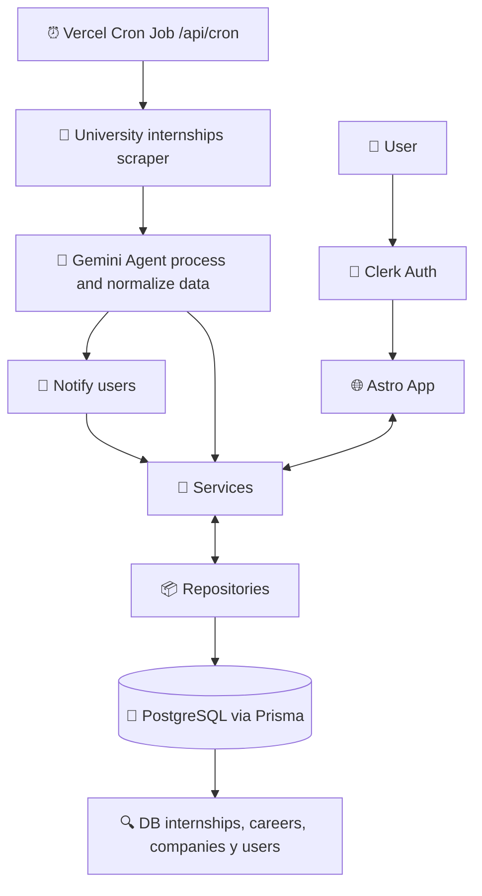

# General Architecture

BuscoPasantías is a monolithic web application built with Astro that serves two main purposes: displaying internships published by any university and automatically notifying subscribed users when a new internship appears that matches their fields of interest. The goal is to achive more universities internships to be displayed on BuscoPasantías App within the time.

## System Flow

The system has two clearly differentiated flows that coexist within the same monolith.

### Automatic flow (cron):

A cron job configured in Vercel periodically triggers the /api/cron endpoint. This endpoint activates ETL system (Extract, Transform, Load) thats built in with a web Puppeteer scraper whose goal is to extract internships published on the universities public websites. The raw scraping data is processed and normalized by a Gemini agent, which structures the information before persisting it. Once the data is stored, the app’s services identify which users have fields of interest that match the new internships and send them a notification.

### User flow:

The user accesses the app through Astro, authenticates via Clerk, and can browse the list of internships, view the details of each one, and manage their interest alerts. All data operations go through a service layer that delegates persistence to repositories, which interact with PostgreSQL through Prisma.

## Internal Layers

The business logic is organized into three layers within src/:

- Controllers — entry point for requests and orchestrates the flow of heavy tasks, delegate to services some work.
- Services — contain the business logic.
- Repositories — the only layer that interacts with the database, using the Prisma client.

This separation allows the business logic to remain independent from the persistence layer, facilitating testing and future changes of ORM or database.
